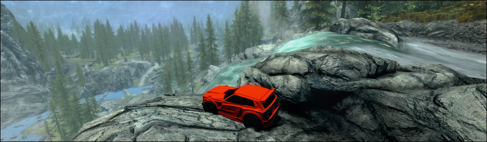

# Skyrim League



Drive a real Rocket League car through Skyrim. Rocket League supplies the Fennec, ball, controller bindings, camera and vehicle physics; Skyrim supplies the world, characters, quests and conversations.

Two local Windows plugins connect the games. Loaded Skyrim terrain is brought into Rocket League's native Bullet collision world, so suspension and wheels drive on Skyrim's actual surfaces. Moving objects and NPCs exchange contact responses across engines. Skyrim renders the extracted car and ball meshes with textures, lighting, boost and outdoor shadows.

**Experimental, offline project.** Terrain driving and controller input are verified in paired Linux/Proton play. Native Windows setup is implemented and tested through Windows executables and Python under headless Wine; actual Windows gameplay still needs validation.

## Downloads and setup

Get the Windows bundle and source archive from [Releases](https://github.com/rippelz/skyrim-league/releases). Start with **[Windows setup](WINDOWS.md)** or **[Linux setup](docs/LINUX.md)**.

The Windows bundle includes both bridge DLLs, setup scripts, the browser launcher and source. You supply the games, matching SKSE/Address Library/BakkesMod and locally extracted visuals. Game assets, saves, account details and machine-specific settings are excluded from the repository and release downloads.

| Dependency | Tested version |
|---|---|
| Rocket League | Steam builds 25400034 / 25535926, offline Free Play |
| BakkesMod | Runtime 228 |
| Skyrim Special Edition | Steam 1.7.104.0 |
| SKSE64 | 2.3.1 |
| Address Library | v13 for 1.7.104.0 |

Installation and launch reject unsupported versions. New game/BakkesMod releases can require changes to the engine hooks. The native Windows launcher supports Steam editions; Epic/GOG launch paths are not implemented.

## Play

1. Keep Steam signed in. Start the games through **Skyrim League**: `bridge-ui.cmd` on Windows or `./bridge-ui.sh` on Linux.
2. Enter offline Free Play in Rocket League and load a Skyrim save in an open area.
3. Press **F8** to anchor the car to your Skyrim position and activate the bridge.
4. Drive with your normal RL controller bindings. Click RS/R3 for the car menu wheel, choose with the left stick or D-pad, and press A/Cross to select or B/Circle to cancel. Driving pauses while the wheel or a Skyrim menu is open. Native menus use their normal controller controls. B/Circle (or E) talks, uses objects, reads books, harvests plants and picks up nearby items.

| Control | Action |
|---|---|
| F8 | Activate/deactivate and anchor |
| F9 | Re-anchor |
| F10 | Bring the ball ahead of the car |
| B / Circle | Skyrim interaction, while retaining the RL binding |
| E | Keyboard interaction |

The launcher manages owned game sessions and settings for lighting, shadows, damage, interpolation, camera follow and startup behavior. Windows offers independent Desktop/Minimized and monitor choices. Linux additionally supports private displays, browser views and Hyprland workspaces. Save Skyrim before stopping a session. Modern C++ runtime DLLs needed by the bridge are applied only during its offline session; RL’s original DLLs are restored for normal Steam/EAC launches.

## What works, and current limits

- Real Fennec and standard ball geometry with original local texture maps; procedural boost visuals.
- Native terrain contacts, suspension, slopes, jumps and driving beyond the original RL arena bounds.
- Moving-body contact feedback and NPC ragdoll/damage responses. Dynamic hulls approximate object geometry; ragdoll joints stay in Skyrim rather than being duplicated in the coupling solver.
- NPC conversations and interactions, with driving paused while menus are open.
- Directional outdoor mesh shadows. Interior point-light shadow casting is not implemented.
- Background packet reception, a stable interpolation clock and up to 20 ms of visual prediction to cover brief stream gaps.

Equipped decals, wheel cosmetics and animated wheel steering/suspension are not streamed. RL's original material shaders are approximated. Windows virtual desktop placement and Linux-style private display streaming are not implemented on Windows. Controllers must be visible through XInput for native background input.

## Build and test

On Windows, install Git and Visual Studio's C++ desktop workload, then open an **x64 Native Tools Command Prompt**:

```bat
py -3 -m pip install cmake ninja -r requirements-windows.txt
py -3 tools\build_windows.py
```

For Linux cross builds, see [Linux setup](docs/LINUX.md). Both game DLLs require the x64 MSVC ABI; MinGW is unsupported. The build scripts create one uniformly patched Bullet source tree to match RL's collision-shape virtual layout.

Core/timing tests without either game:

```bash
cmake -S . -B build -DCMAKE_BUILD_TYPE=Release
cmake --build build --parallel 4
ctest --test-dir build --output-on-failure
```

The native Windows build also runs contact tests, including 100 ball contact/reset/teleport/body-destruction cycles. Tests validate transport, transforms, bounded prediction, ownership safeguards and coupling behavior; they do not replace in-game validation. See [development notes](docs/DEVELOPMENT-NOTES.md) for implementation details and historical validation.

## License and credits

Project code is **GPL-3.0-or-later**. See [LICENSE](LICENSE) and [third-party notices](THIRD_PARTY.md). Engine/render integration draws on SkyCraft; native terrain work also draws on RLArenaCollisionDumper. Dependency sources and versions are pinned by the fetch/build scripts. Extracted Rocket League assets remain private and retain their original rights.
